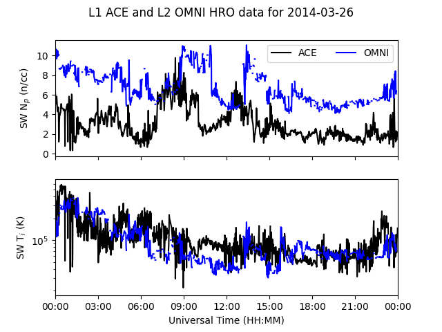

.. _exace:

Make ACE SWEPAM behave like OMNI Data
=====================================

NASA OMNI data (also available from `pysatNASA
<https://github.com/pysat/pysatNASA>`_) is *the* place to go for solar wind
(SW) parameters.  However, this data set is not available in real time.
Fortunately, we can use the `OMNI processing
<https://omniweb.gsfc.nasa.gov/html/omni_min_data.html>`_ to normalize the ACE
SWEPAM SW proton density and ion temperature.  This is performed using the
:py:func:`pysatSpaceWeather.instruments.methods.ace.ace_swepam_hourly_omni_norm`
function.  The example below uses historic ACE SWEPAM data so that we can
compare the results to OMNI.

::

   import datetime as dt
   import matplotlib as mpl
   import matplotlib.pyplot as plt

   import pysat
   import pysatSpaceWeather as py_sw
   from pysatNASA.instruments import omni_hro

   ace = pysat.Instrument(inst_module=py_sw.instruments.ace_swepam,
                          tag='historic', update_files=True)
   omni = pysat.Instrument(inst_module=omni_hro, tag='1min', update_files=True)

   # Add the OMNI conversion routine to the ACE instrument
   ace.custom_attach(py_sw.instruments.methods.ace.ace_swepam_hourly_omni_norm)

   # Pick a day with a geomagnetic storm
   stime = dt.datetime(2014, 3, 26)

   # If needed, download the data
   if stime not in ace.files.files.index:
       ace.download(start=stime)

   if stime not in omni.files.files.index:
       omni.download(start=stime)

   # Load the data
   ace.load(date=stime)
   omni.load(date=stime)

   print(ace.variables)

This should yield ``Index(['jd', 'sec', 'status', 'sw_proton_dens',
'sw_bulk_speed', 'sw_ion_temp', 'sw_proton_dens_norm', 'sw_ion_temp_norm'],
dtype='object')``. The variables with the ``'norm'`` suffix were added by the
conversion function.  Now, let's plot the two data sets together.

::

   fig = plt.figure()
   fig.suptitle("L1 ACE and L2 OMNI HRO data for {:}".format(stime.date()))
   ax_dens = fig.add_subplot(211)
   ax_temp = fig.add_subplot(212)

   ax_dens.plot(ace.index, ace['sw_proton_dens_norm'], 'k-', label='ACE')
   ax_dens.plot(omni.index, omni['proton_density'], 'b-', label='OMNI')
   ax_temp.plot(ace.index, ace['sw_ion_temp_norm'], 'k-', label='ACE')
   ax_temp.plot(omni.index, omni['T'], 'b-', label='OMNI')
   ax_temp.set_yscale('log')
   ax_dens.xaxis.set_major_formatter(mpl.dates.DateFormatter(''))
   ax_temp.xaxis.set_major_formatter(mpl.dates.DateFormatter('%H:%M'))
   ax_dens.set_xlim(stime, stime + dt.timedelta(days=1))
   ax_temp.set_xlim(stime, stime + dt.timedelta(days=1))
   ax_temp.set_xlabel('Universal Time (HH:MM)')
   ax_dens.set_ylabel(r'SW N$_p$ ({:s})'.format(omni.meta['proton_density',
                                                          'units']))
   ax_temp.set_ylabel(r'SW T$_i$ ({:s})'.format(omni.meta['T', 'units']))
   ax_dens.legend(loc=1, fontsize='medium', ncol=2)

   # If not running in interactive mode
   plt.show()

This figure shows that the temperature adjustment agrees relatively well, but
that the proton density has a large offset.  This descrepency can be attributed
to the data source.  The :py:mod:`pysatSpaceWeather.instruments.ace_swepam`
module uses L1 data, while OMNI uses L2 data that has undergone additional
processing.  For this time period most of the temperature data is of high
quality in the L2 data, but all the proton density data is flagged for removal.
The ACE L2 data is accessible through CDAWeb or the `ACE database
<https://izw1.caltech.edu/ACE/ASC/level2/index.html>`_.

