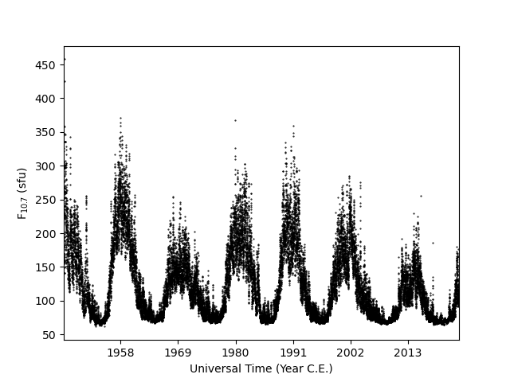

.. _exf107:

Load F\ :sub:`10.7`\ from Multiple Sources
==========================================

As shown in :ref:`exinit`, :py:mod:`pysatSpaceWeather` has several sources that
provide F\ :sub:`10.7`\ over different time periods.  It can be useful to
combine these data sets into a single :py:class:`pysat.Instrument` object.
This may be done using the
:py:func:`~pysatSpaceWeather.instruments.methods.f107.combine_f107` function.

::

   import datetime as dt
   import matplotlib as mpl
   import matplotlib.pyplot as plt

   import pysat
   import pysatSpaceWeather as py_sw

   f107_hist = pysat.Instrument(inst_module=py_sw.instruments.sw_f107,
                                tag='historic', update_files=True)
   f107_prel = pysat.Instrument(inst_module=py_sw.instruments.sw_f107,
                                tag='prelim', update_files=True)
   f107_fore = pysat.Instrument(inst_module=py_sw.instruments.sw_f107,
                                tag='45day', update_files=True)

   # If needed, download the data
   f107_hist.download(start=f107_hist.lasp_stime, stop=f107_hist.today(),
                      freq='MS')
   f107_prel.download(start=f107_hist.files.files.index[-1],
                      stop=f107_prel.today())
   f107_fore.download(start=f107_fore.today())

   # Check the downloaded file range for the historic source
   print(f107_hist.files.files.index.min(), f107_hist.files.files.index.max())

This should yield ``1947-02-01 00:00:00 2018-04-30 00:00:00``. Now, combine the
data in these :py:class:`pysat.Instruments` using the 
:py:func:`~pysatSpaceWeather.instruments.methods.f107.combine_f107` function
twice, after loading the available data

::

   # Load all the data
   f107_hist.load(date=f107_hist.lasp_stime,
                  end_date=f107_hist.files.files.index.max() +
		  dt.timedelta(days=1))
   f107_prel.load(fname=f107_prel.files.files[0],
                  stop_fname=f107_prel.files.files[-1])
   f107_fore.load(date=f107_fore.today())
   
   # Combine the historic sources for all available times
   f107 = py_sw.instruments.methods.f107.combine_f107(f107_hist, f107_prel)

   # Combine the 45 day measurements and forecast
   f107 = py_sw.instruments.methods.f107.combine_f107(f107, f107_fore)

   # Check the combined Instrument index
   print(f107.index[0], f107.index[-1])

This print statement yields ``1947-02-14 00:00:00 2022-10-07 00:00:00``, where
the end date is roughly 45 days in the future to account for the forecasted data.
The combined :py:class:`pysat.Instrument` varialbe, ``f107`` can be used
to plot the F\ :sub:`10.7`\ over time.

::

   fig = plt.figure()
   ax = fig.add_subplot(111)

   ax.plot(f107.index, f107['f107'], 'k.', ms=1)
   ax.xaxis.set_major_formatter(mpl.dates.DateFormatter('%Y'))
   ax.xaxis.set_major_locator(mpl.dates.YearLocator(11))
   ax.set_xlim(f107.index[0], f107.index[-1])
   ax.set_xlabel('Universal Time (Year C.E.)')
   ax.set_ylabel(r'F$_{10.7}$ (sfu)')

   # If not running in interactive mode
   plt.show()

