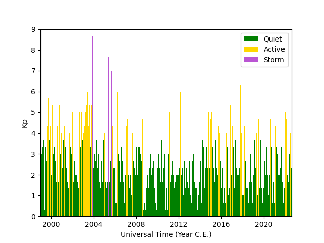

.. _exkp:

Load Kp from Multiple Sources
=============================

Following from the previous F\ :sub:`10.7`\ example, :ref:`exf107`,
:py:mod:`pysatSpaceWeather` has a routine to combine several sources of Kp over
different time periods. This may be done using the
:py:func:`~pysatSpaceWeather.instruments.methods.kp_ap.combine_kp` function.

::

   import datetime as dt
   import matplotlib as mpl
   import matplotlib.pyplot as plt
   
   import pysat
   import pysatSpaceWeather as py_sw

   kp_his = pysat.Instrument(inst_module=py_sw.instruments.sw_kp,
                             tag='', update_files=True)
   kp_rec = pysat.Instrument(inst_module=py_sw.instruments.sw_kp,
                             tag='recent', update_files=True)
   kp_for = pysat.Instrument(inst_module=py_sw.instruments.sw_kp,
                             tag='forecast', update_files=True)

   # Set the time range
   stime = dt.datetime(1999, 1, 1)
   etime = kp_for.today()

   # If needed, download the data
   kp_his.download(start=stime, stop=etime)
   kp_rec.download(start=stime, stop=etime)
   kp_for.download(start=etime)

   # Combine the Kp sources for all available times
   kp = py_sw.instruments.methods.kp_ap.combine_kp(kp_his, kp_rec, kp_for,
                                                   stime, etime)

   # Check the combined Instrument index
   print(kp.index[0], kp.index[-1])

This yeilds ``1999-01-01 00:00:00 2022-08-23 21:00:00``, where the last date is
your current date (not the date that I created this example).  Now, we can take
the combined :py:class:`pysat.Instrument` can be used to plot the Kp over time.

::

   fig = plt.figure()
   ax = fig.add_subplot(111)

   # Color code data by activity level
   ax.bar(kp.data.loc[kp['Kp'] < 4, 'Kp'].index,
          kp.data.loc[kp['Kp'] < 4, 'Kp'], color='green', label='Quiet')
   ax.bar(kp.data.loc[(kp['Kp'] >= 4) & (kp['Kp'] < 7), 'Kp'].index,
          kp.data.loc[(kp['Kp'] >= 4) & (kp['Kp'] < 7), 'Kp'], color='orange',
          label='Active')
   ax.bar(kp.data.loc[kp['Kp'] >= 7, 'Kp'].index,
          kp.data.loc[kp['Kp'] >= 7, 'Kp'], color='firebrick', label='Storm')

   # Format the figure
   ax.set_xlim(stime, etime)
   ax.set_ylim(0, 9)
   ax.xaxis.set_major_formatter(mpl.dates.DateFormatter('%Y'))
   ax.set_xlabel('Universal Time (Year C.E.)')
   ax.set_ylabel(r'Kp')
   ax.legend(loc=1, fontsize='medium')

   # If not running in interactive mode
   plt.show()

Convert Kp to ap
================

The Kp and ap have a well established relationship, which takes the logarithmic
Kp index and converts it to a linear scale that is easier to handle numerically.
The :py:func:`~pysatSpaceWeather.instruments.methods.kp_ap.convert_3hr_kp_to_ap`
converts Kp to ap, as shown below.

::
   py_sw.instruments.methods.kp_ap.convert_3hr_kp_to_ap(kp)

   print("Max: {:.1f} -> {:d}, Min: {:.1f} -> {:d}".format(
       kp['Kp'].max(), kp['3hr_ap'].max(), kp['Kp'].min(), kp['3hr_ap'].min()))

This yields ``Max: 9.0 -> 400.0, Min: 0.0 -> 0.0``. 
