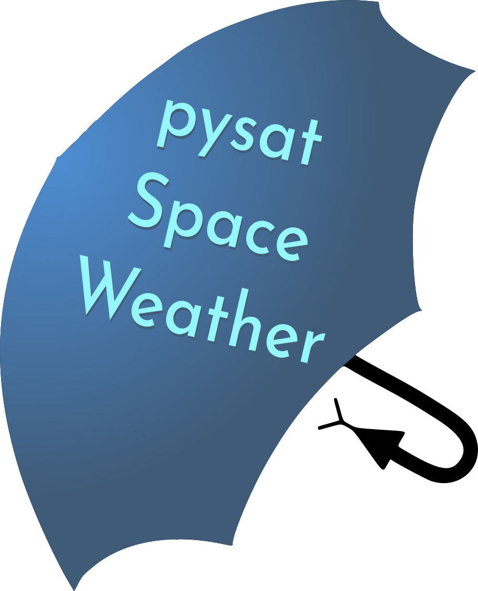

Overview
========

Space weather indices are useful for a range of applications, including
observation-based scientific analysis, model-based scientific analysis, and
space weather predictions.  pysatSpaceWeather addresses each of these needs by
providing a pysat interface for solar and geomagnetic space weather indices.
Different methods exist to easily load a single index from multiple sources and
to convert between common equivalent indices (e.g., between Kp and Ap).

